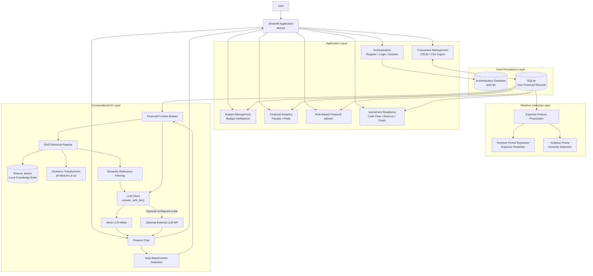

# Finlytic AI — Intelligent Personal Finance Assistant

Finlytic AI is a multi-user personal finance application built with **Python and Streamlit**. It combines financial analytics, budgeting, machine learning, rule-based financial insights, semantic retrieval, and a Finance Chat interface to help users understand and manage their financial data.

The application supports user-specific financial records, transaction management, budget monitoring, spending trends, anomaly detection, cash-flow analysis, goal planning, and educational investment scenarios. It is designed as an educational and portfolio project—not as a substitute for professional financial advice.

---

## 🚀 Key Features

### 🔐 1. Authentication & Multi-User Support

- User registration and login
- Password reset using a temporary verification code
- Session-based authentication
- Separate financial database per user
- User-specific transactions, budgets, and analytics

Passwords are stored as password hashes rather than plain text. Database separation provides logical isolation between user accounts.

### 📊 2. Financial Dashboard

The dashboard summarizes a user's recorded financial activity:

- Total income and expenses
- Net savings and savings rate
- Spending by category
- Financial summaries and visual analytics

All dashboard metrics are based on the transactions stored in the user's database.

### 💳 3. Transaction Management

Users can add, view, update, and delete transactions. Transaction records include fields such as date, description, category, amount, and transaction type (income or expense). CSV import is also supported.

### 📈 4. Financial Analytics & Historical Spending Trends

The analytics experience includes:

- Income and expense analysis
- Category-wise spending
- Savings analysis
- Monthly financial summaries
- Current-month versus previous-month comparisons
- Recent monthly spending trends
- Category-wise month comparisons

Historical views distinguish the current partial month from completed months. Months without recorded transactions may appear as ₹0, so comparisons should be interpreted in light of the available records.

### 💰 5. Budget Health & Budget Intelligence

Users can create or update monthly limits for expense categories and compare planned budgets with actual recorded spending.

Budget features include:

- Monthly category budgets
- Budget-versus-actual comparison
- Remaining amount by category
- Overall budget usage
- Category-level budget health
- Budget threshold alerts
- Spending insights
- Pace-based month-end spending estimates when enough days and data are available

The projection is paused during the first six days of the month. Actual spending and budget-limit alerts continue to be tracked during that period. A projection is an estimate, not a guaranteed month-end result.

### 🤖 6. Financial Advisor — Rule-Based Insights

The Financial Advisor page provides explainable, rule-based observations derived from recorded financial metrics.

It includes:

- Income, expenses, net savings, and savings rate
- A financial-health summary
- Largest spending category
- Average expense transaction
- Personalized rule-based recommendations
- Spending signals for major expense categories

These are transparent rules based on the current data, not LLM-generated advice or predictions.

### 🔮 7. Expense Prediction

Finlytic AI includes an experimental machine-learning module that uses historical expense features to estimate future expenses.

The general workflow is:

1. Retrieve historical transaction data.
2. Prepare expense data.
3. Generate time-based features.
4. Train or use the prediction model.
5. Produce an expense estimate.
6. Compare the estimate with historical spending.

The model is experimental. Its performance depends on the quantity and quality of the user's transaction history, and its estimates should not be treated as reliable financial forecasts.

### 🚨 8. Spending Anomaly Detection

The anomaly detection module uses **Isolation Forest**, an unsupervised machine-learning algorithm, to flag potentially unusual expense amounts.

The page displays:

- Number of expense transactions evaluated
- Anomalies detected
- Normal transactions
- Anomaly rate
- Flagged transactions, when present
- Detection method and interpretation notes

The current detection uses transaction amount as its feature and does not require labeled examples. An anomaly is a statistical signal—not proof of an incorrect or fraudulent transaction. With very little data, the model may not identify meaningful patterns; results should be interpreted cautiously.

### 📈 9. Investment Readiness & Goal Planning

The Investment Readiness module connects recorded cash flow with user-entered planning assumptions.

**Planning inputs**
- Current liquid savings or reserve
- Essential monthly expenses
- Target emergency-reserve duration
- Months selected to build the reserve
- Other planned monthly commitments

**Cash-flow and reserve analysis**
- Average monthly income and expenses
- Average monthly surplus and savings rate
- Positive-surplus and non-negative months
- Surplus volatility
- Recorded cash surplus
- Required reserve, current reserve, reserve gap, and reserve coverage
- Potential monthly amount available after reserve allocation and commitments

The module distinguishes a potential planning amount from money that is confirmed safe to invest. Estimates are sensitive to the user's inputs and the amount of transaction history available.

**Goal planning**
- Set a target amount and timeline
- Calculate the monthly amount required
- Compare the required amount with the available planning amount
- Explore possible adjustments to the target, timeline, or contribution

**Illustrative investment scenarios**
- Choose a monthly contribution and duration
- Adjust an assumed annual return
- View total contributions, illustrative value, and illustrative growth
- Compare lower-, selected-, and higher-return assumptions

Scenario calculations are mathematical illustrations only. Returns are not guaranteed; fees, taxes, inflation, and product-specific risks are not modeled. The module does not recommend specific securities or investment products.

### 💬 10. Finance Chat

Finance Chat lets users ask questions about their financial data and finance-related topics. The application includes rule-based intent detection, access to financial summaries and relevant modules, and an LLM integration layer.

Supported question areas include:

- Income, expenses, and savings
- Category spending and comparisons
- Expense analysis and prediction
- Anomaly detection
- Financial summaries
- General financial questions

The application can run in **Mock LLM mode**, so API credits are not required for the current local setup. Mock mode is a local fallback and should not be described as a live hosted LLM response.

### 🧠 11. Local Retrieval-Augmented Generation (RAG)

Finlytic AI includes a local semantic retrieval pipeline for finding relevant material in a controlled financial knowledge base.

**RAG workflow**

```text
User question
     |
     v
Query processing
     |
     v
Semantic embedding
     |
     v
Knowledge-base search
     |
     v
Similarity scoring
     |
     v
Relevance filtering
     |
     v
Relevant financial context
     |
     v
Finance Chat integration
```

**Semantic embeddings**
- Model: `sentence-transformers/all-MiniLM-L6-v2`
- Embedding dimension: 384
- Semantic similarity scoring

**Knowledge base**
- `data/knowledge_base/finance_basics.md`
- Topics include emergency funds, budgeting, savings rate, needs and wants, debt management, and financial safety.

**Chunking and retrieval**
- Section-aware Markdown chunking
- Section titles preserved in chunks
- Approximate maximum chunk size: 180 words
- Approximate overlap: 30 words
- In-memory embeddings and semantic retrieval
- Relevance threshold: approximately `0.40`

The current RAG capability retrieves and filters relevant knowledge. It should not be represented as fully grounded, citation-backed answer generation unless that feature is implemented and verified.

### 🧠 12. LLM Integration Layer

The dedicated LLM client supports a mock response path and an API-backed integration path.

Current local configuration:

```env
OPENAI_API_KEY=
OPENAI_MODEL=gpt-5.6
MOCK_LLM=true
```

Mock mode allows development without an API key or paid API usage. Keep real credentials in a local `.env` file and never commit secrets.

---

## 🏗️ System Architecture

Finlytic AI follows a modular, layered architecture. The Streamlit application provides the presentation and orchestration layer, while authentication, financial data processing, persistence, machine-learning workflows, retrieval-augmented generation, and LLM interaction are separated into dedicated components.

### High-level architecture



### Component responsibilities

- **Presentation and orchestration:** `app.py` renders the Streamlit interface, handles navigation, and coordinates the application modules.
- **Authentication and persistence:** authentication uses `auth.db`; financial records are stored in the SQLite database with user-specific data separation.
- **Financial processing:** transaction and budget operations supply data for historical analytics, budget intelligence, rule-based insights, and investment-readiness calculations.
- **Machine learning:** expense feature preparation feeds the Random Forest prediction workflow and Isolation Forest anomaly detection.
- **RAG pipeline:** Finance Chat combines intent detection and transaction-derived context with local semantic retrieval. Retrieved passages are filtered by relevance before being assembled into the LLM request.
- **LLM integration:** the LLM client abstracts response generation. Mock mode supports local use without API credits, while an external LLM API is an optional configured path.

### Architecture overview

| Layer / Module | Responsibility |
|---|---|
| `app.py` | Main Streamlit application and navigation |
| Authentication | Registration, login, password handling, and session state |
| `database.py` | SQLite connections and user-specific data access |
| Transactions | Financial record management and CSV import |
| `analysis.py` | Financial analytics and spending analysis |
| Budget module | Monthly budgets, actual spending, alerts, and pace estimates |
| Investment Readiness | Reserve planning, cash-flow metrics, goal calculations, and scenarios |
| Financial Advisor | Rule-based financial insights and recommendations |
| `ml_expense_prediction.py` | Experimental expense prediction |
| `anomaly_detection.py` | Isolation Forest anomaly detection |
| `finance_chat.py` | Finance Chat orchestration, intent detection, and financial context |
| `rag_engine.py` | Local knowledge-base chunking, embeddings, retrieval, and filtering |
| `llm_client.py` | Mock and API-backed LLM integration paths |
| `config.py` | Environment and application configuration |

Module names and file placement may vary slightly by the current local project version.

---

## 🛠️ Technology Stack

| Area | Technology | Purpose |
|---|---|---|
| Programming language | Python | Application logic and data processing |
| UI | Streamlit | Interactive application interface |
| Data processing | Pandas, NumPy | Transaction processing and calculations |
| Visualization | Streamlit charts/components, Plotly and other project plotting tools | Financial charts and comparisons |
| Database | SQLite | Authentication and financial data storage |
| Authentication | PBKDF2-HMAC-SHA256, session state | Password hashing and authenticated sessions |
| Machine learning | Scikit-learn | Prediction and anomaly detection |
| Anomaly detection | Isolation Forest | Unsupervised unusual-spending detection |
| NLP / RAG | Sentence Transformers | Semantic embeddings |
| Embedding model | `all-MiniLM-L6-v2` | Text vector generation |
| Retrieval | Similarity scoring and relevance filtering | Knowledge retrieval |
| LLM integration | OpenAI client architecture, mock mode | Optional language-model response path |
| Configuration | `python-dotenv`, `.env` | Local configuration and secrets |
| Version control | Git and GitHub | Source control |

---

## 📁 Project Structure

The following is a high-level structure based on the project modules described here. Confirm the exact filenames against the current repository before relying on this as a complete file listing.

```text
Finlytic-AI/
├── app.py
├── README.md
├── architecture.md
├── requirements.txt
├── .gitignore
├── .env                  # local only; do not commit
├── data/
│   └── knowledge_base/
│       └── finance_basics.md
├── src/
│   ├── analysis.py
│   ├── anomaly_detection.py
│   ├── auth.py
│   ├── config.py
│   ├── database.py
│   ├── finance_chat.py
│   ├── llm_client.py
│   ├── ml_expense_prediction.py
│   └── rag_engine.py
└── .streamlit/
    └── config.toml
```

Local database files may be stored under a data directory and should remain excluded from version control.

---

## 🔐 Data & Security Notes

- Passwords are hashed rather than stored as plain text.
- User financial records are stored in separate SQLite databases.
- API credentials belong in `.env`, not in source code.
- `.env` and local database files should be excluded through `.gitignore`.
- Do not commit real personal transaction records, credentials, or other sensitive data.

Example `.gitignore` entries:

```gitignore
.env
*.db
*.sqlite
*.sqlite3
__pycache__/
.venv/
venv/
```

These measures are project-level safeguards and do not constitute a formal security audit.

---

## ▶️ How to Run the Project

### 1. Clone the repository

```bash
git clone https://github.com/arka829636/Finlytic-AI.git
cd Finlytic-AI
```

### 2. Create and activate a virtual environment

```bash
python -m venv venv
```

Windows:

```bash
venv\Scripts\activate
```

### 3. Install dependencies

```bash
pip install -r requirements.txt
```

### 4. Configure the environment

Create a `.env` file in the project root:

```env
OPENAI_API_KEY=
OPENAI_MODEL=gpt-5.6
MOCK_LLM=true
```

Mock mode can run without an API key or paid API credits.

### 5. Start the application

```bash
python -m streamlit run app.py --server.fileWatcherType none
```

The application should open in the browser.

---

## 🧪 Current Project Status

### Implemented

- [x] User registration and login
- [x] Password reset flow
- [x] Multi-user support and user-specific financial databases
- [x] Financial dashboard
- [x] Transaction management and CSV import
- [x] Financial analytics
- [x] Historical spending trends and month comparisons
- [x] Monthly category budgets
- [x] Budget-versus-actual analysis
- [x] Budget Intelligence and threshold alerts
- [x] Pace-based month-end spending estimates with a minimum-data window
- [x] Rule-based Financial Advisor
- [x] Experimental expense prediction
- [x] Isolation Forest anomaly detection
- [x] Investment Readiness and reserve planning
- [x] Goal planning and illustrative return scenarios
- [x] Finance Chat running in the local application
- [x] Mock LLM integration path
- [x] Local finance knowledge base
- [x] Section-aware RAG chunking
- [x] Semantic embeddings and retrieval
- [x] Relevance filtering
- [x] Git/GitHub project setup

### Planned improvements

- Grounded RAG answer generation with source references
- Hallucination checks and answer evaluation
- Hybrid keyword and semantic retrieval
- Retrieval reranking
- Personalized knowledge retrieval
- Improved forecasting evaluation with sufficient data
- More extensive testing and edge-case handling
- Production deployment and security review
- Responsive UI refinements

---

## ⚠️ Data Limitations & Interpretation

Many calculations depend on the transaction history available for the signed-in user. A small or incomplete dataset can produce unstable averages, limited trend comparisons, weak prediction performance, or uninformative anomaly-detection results.

For example, a page showing zero detected anomalies does not prove that every transaction is ordinary; it means the current model did not flag any of the evaluated records. Likewise, potential investable surplus and illustrative investment values are planning calculations, not guarantees or personalized investment recommendations.

---

## 🎯 Project Objectives

1. Build a practical personal finance management application.
2. Implement multi-user authentication and logical data isolation.
3. Analyze income, expenses, budgets, and spending patterns.
4. Apply machine learning to financial transaction data.
5. Detect potentially unusual expense transactions.
6. Experiment with future expense estimation.
7. Provide explainable, rule-based financial insights.
8. Connect recorded cash flow with reserve and goal-planning calculations.
9. Build a finance-oriented conversational interface.
10. Implement local semantic retrieval over financial educational material.
11. Demonstrate an end-to-end application combining analytics, ML, and AI components.

---

## 💡 Real-World Problem

Personal finance information is often spread across transaction records, budgets, and separate tools. Users may find it difficult to understand where money goes, compare spending over time, identify unusual activity, or relate current cash flow to future goals.

Finlytic AI brings these activities into one interface:

```text
Financial records
       |
       v
Data processing
       |
       +----> Analytics and historical trends
       |
       +----> Budget monitoring and alerts
       |
       +----> Rule-based financial insights
       |
       +----> ML prediction and anomaly detection
       |
       +----> Reserve and goal planning
       |
       +----> Finance Chat and knowledge retrieval
```

---

## 🎓 Skills Demonstrated

- Python programming
- Data analysis and data processing
- SQL and SQLite
- Streamlit application development
- Data visualization
- Machine learning
- Unsupervised learning and anomaly detection
- Experimental forecasting
- Natural language processing
- Text embeddings and semantic search
- Retrieval-Augmented Generation foundations
- LLM integration architecture
- Authentication and database design
- Modular application architecture
- Git and GitHub

---

## ⚠️ Disclaimer

Finlytic AI is an educational and portfolio project. Its financial insights, predictions, anomaly flags, planning calculations, and illustrative scenarios are for informational and demonstration purposes only. They are not professional financial advice, a guarantee of future results, or a recommendation to buy or sell any financial product.

---

## 👨‍💻 Author

**Arka Mondal**  
MCA Student | Data Science | Machine Learning | AI | RAG

**Finlytic AI — Intelligent Personal Finance Assistant**

*Data Analytics + Machine Learning + AI + RAG + Database + Streamlit*
